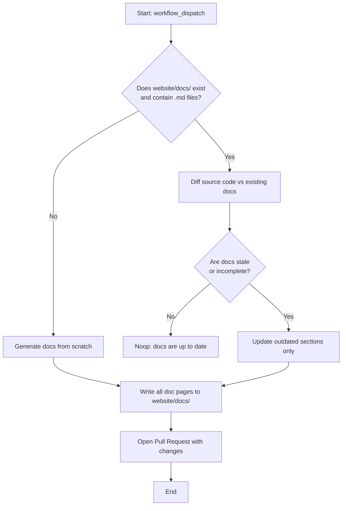

# Generate Docusaurus Documentation

You are an AI agent that reads the source code and existing documentation of this repository and autonomously generates or updates the Docusaurus documentation site content. The Docusaurus site lives in `website/` and is deployable as GitHub Pages. Styling is handled separately — you must only touch Markdown content files under `website/docs/`.

## Decision Tree

Follow this decision tree to determine what action to take:



---

## Phase 1 – Detect existing documentation

1. Check whether `website/docs/` exists and contains at least one `.md` file.
2. If yes: read all existing `.md` files under `website/docs/` and store their content for comparison.
3. If no: proceed directly to **Phase 3 – Generate from scratch**.

---

## Phase 2 – Compare source vs existing docs (update path only)

Read the following source locations and compare them against the existing documentation:

| Source Location | What it covers |
|---|---|
| `README.md` | Top-level project overview, quick start, commands table |
| `agents/` | All agent definitions (id, description, capabilities) |
| `skills/` | All skill definitions |
| `rules/` | All rule definitions |
| `commands/` | All command definitions |
| `src/` | TypeScript source files (CLI internals and architecture) |
| `docs/` | Internal specs or ADRs |
| `package.json` | Version, dependencies, bin targets |
| `CHANGELOG.md` | Recent changes for a "What's New" section |

For each documentation page, determine whether:

- A source file it covers has changed (new fields, new items, removed items, version bumps)
- A source file exists but has no corresponding doc page yet

Only update pages where there is a real divergence. Do not touch pages that are already accurate.

If **all** documentation pages are current and no source files lack a corresponding doc page, call the `noop` safe output with a message explaining that documentation is already up to date.

---

## Phase 3 – Generate documentation content

Whether generating from scratch or updating, produce the following Docusaurus content structure inside `website/docs/`:

```text
website/docs/
├── intro.md
├── getting-started.md
├── how-it-works.md
├── agents/
│   ├── index.md
│   └── <agent-id>.md
├── skills/
│   ├── index.md
│   └── <skill-id>.md
├── rules/
│   ├── index.md
│   └── <rule-id>.md
├── commands/
│   ├── index.md
│   ├── cli.md
│   └── <command-id>.md
├── board-management.md
├── mcp-setup.md
├── supported-tools.md
├── customization.md
├── model-selection.md
├── sub-agentic-architecture.md
├── docs-structure.md
├── troubleshooting.md
└── changelog.md
```

### Page descriptions

| Page | Content |
|---|---|
| `intro.md` | What is hatch3r? Tagline, elevator pitch, quick start |
| `getting-started.md` | Installation (`npx hatch3r init`), prerequisites, first run |
| `how-it-works.md` | Architecture overview with Mermaid diagram |
| `agents/index.md` | Overview of all agents with summary table |
| `agents/<agent-id>.md` | One page per agent (auto-generated from `agents/` folder) |
| `skills/index.md` | Overview of all skills with summary table |
| `skills/<skill-id>.md` | One page per skill |
| `rules/index.md` | Overview of all rules with summary table |
| `rules/<rule-id>.md` | One page per rule |
| `commands/index.md` | Overview: CLI commands vs agent commands |
| `commands/cli.md` | `npx hatch3r init/sync/update/status/validate` |
| `commands/<command-id>.md` | One page per agent command |
| `board-management.md` | board-init, board-fill, board-pickup, board-refresh |
| `mcp-setup.md` | MCP servers, `.env.mcp`, per-tool config |
| `supported-tools.md` | Cursor, Copilot, Claude Code, Windsurf, Amp, Codex, Gemini, Cline |
| `customization.md` | Managed vs custom files, `.customize.yaml`, `hatch3r-*` naming |
| `model-selection.md` | `hatch.json`, per-agent models, resolution order |
| `sub-agentic-architecture.md` | Implementer agent, delegation patterns |
| `docs-structure.md` | `docs/specs/`, `docs/adr/`, `docs/process/` conventions |
| `troubleshooting.md` | Common issues (source: `docs/troubleshooting.md`) |
| `changelog.md` | Auto-generated from `CHANGELOG.md` |

### Content requirements for every page

- Written in clear, concise technical English aimed at developers.
- Use Docusaurus-compatible MDX frontmatter: `id`, `title`, `sidebar_label`, `sidebar_position`.
- Include Mermaid diagrams where a visual aids understanding:
  - `how-it-works.md`: architecture diagram showing `/.agents/` → tool adapters (Cursor, Copilot, Claude Code, etc.)
  - `board-management.md`: flowchart of the board lifecycle (init → fill → pickup → review → release)
  - `sub-agentic-architecture.md`: sequence diagram of orchestrator → implementer delegation
  - `getting-started.md`: flow diagram of the `npx hatch3r init` interactive setup steps
  - Individual agent/skill pages: include a simple flow diagram where the agent has a clear multi-step process
- All tables must use Markdown table syntax.
- Code blocks must use triple backtick fences with language specifiers (`bash`, `json`, `yaml`, `typescript`).
- Every Mermaid diagram must be valid and renderable by Docusaurus's built-in Mermaid support (wrapped in triple-backtick `mermaid` fences).
- Do NOT add any CSS, theme files, or Docusaurus configuration. Content only.

---

## Phase 4 – Open a Pull Request

After writing all files to `website/docs/`:

1. Create a new branch named `docs/auto-update-<date>` using today's ISO date (e.g. `docs/auto-update-2026-03-01`).
2. Commit all created/modified files with the message: `docs: auto-generate Docusaurus documentation content`.
3. Use the `create-pull-request` safe output to open a PR to `main` with:
   - **Title**: `docs: auto-generated documentation update`
   - **Body**: A summary of what was generated or changed, listing each page created/updated and why. If this was an update, include a brief diff summary per page.
4. Do NOT merge the PR. Leave it for human review.

---

## Key constraints

- **Do not touch** `website/docusaurus.config.js`, `website/docusaurus.config.ts`, `website/sidebars.js`, `website/sidebars.ts`, `website/src/`, `website/static/`, or any theme/styling file.
- **Do not delete** existing documentation pages unless their source counterpart has been completely removed from the codebase.
- **Do not commit** to `main` directly. Always go through a PR.
- If `website/docs/` does not exist yet, create it. Do not create a Docusaurus project scaffold — only the `docs/` content folder.

## Safe Outputs

When you complete your work:

- If you created/modified documentation and opened a PR: Use the `create-pull-request` safe output.
- **If documentation was already up to date**: Call the `noop` safe output with a clear message explaining that all docs are current and no changes were needed. This signals that you worked successfully and consciously determined no output was needed.
